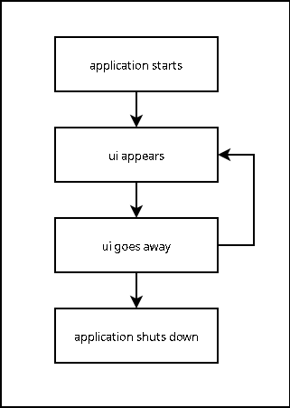

# Fixing The Android Lifecycle

## The Problem(s)

The Palace Android application (and indeed almost any Android application you
care to name) has _lifecycle issues_.

Android forces a programming model upon developers known as the
_Android Lifecycle_. The programming model has no benefits, and is extremely
error-prone, with almost any mistake leading to an application crash. The
programming model leads to an execution flow that is almost impossible to
reason about, with every additional bit of functionality causing a combinatorial
explosion of new problems.

Unfortunately, Android developers on the whole do not have the confidence to
stand up to Google and say "I'm As Mad As Hell and I'm Not Gonna Take This
Anymore!" and so go on to implement applications using their broken components.
The Palace App, due to historical circumstance, is a product of this environment.

Android applications are divided up into _Activities_, and inside the
_Activities_ are one or more hosted _Fragments_. As a concrete example, the
Palace Audiobook viewer is one _Activity_ (namely, `org.librarysimplified.viewer.audiobook.AudioBookPlayerActivity`).
Inside this _Activity_ are at most four _Fragments_; one for the player itself,
one for the loading bar that appears on first opening a book, and a couple for
handling the table of contents. A _Fragment_ is generally responsible for
containing logic relating to views onscreen.

Developers are expected to subclass `Activity` and `Fragment` in their own
applications, and override various methods defined on those classes. The Android
system will call these methods in a poorly-defined order that effectively
results in this completely absurd state machine:

Note that there is not just one of these state machines: There is one of these
state machines _for every `Activity` and `Fragment` instance in the application,
with multiple of them overlapping at any given time_.

The issues that applications face are manifold, and all of the following
have been responsible for application crashes in the past few months:

  * The application is resumed, and starts in an `Activity` other than the
    one that normally starts up when the application starts. The developer
    finds out that application state that would normally have been initialized
    (by a different `Activity` or `Fragment`) hasn't been initialized. The 
    program crashes.
  * Android UI components can only be access on the Android _UI Thread_. The
    programmer schedules an operation to occur on the UI thread such as toggling
    a checkbox. By the time the operation is _actually_ scheduled by the
    operating system, the `Activity` or `Fragment` containing the checkbox
    has been detached or destroyed by the lifecycle system. The program
    crashes.
  * Code in a `Fragment` subscribes to a stream of events so that it can
    update onscreen UI components. Unfortunately, it forgets to unsubscribe
    when a `Fragment` is detached. An event is raised by something in the
    application, and the (now detached) `Fragment` code tries to do something
    involving the `Fragment`. The program crashes.
  * Code in a `Fragment` subscribes to a stream of events so that it can
    update onscreen UI components. Unfortunately, it forgets to unsubscribe
    when a `Fragment` is detached. The `Fragment` is resumed before any
    catastrophe occurs, but the `Fragment` subscribes _again_ to the stream
    of events (not realizing that it was already subscribed). An event is
    raised by something in the application and is handled twice. The program
    probably crashes. It's a safe bet.
  * In Google's infinite wisdom, the `Activity` programming model was built
    around the (insane) idea that sometimes a single `Activity` within an
    application might run as an entirely separate process. This meant that,
    in order to present a uniform programming model, any communication between
    `Activity` instances is treated the same as IPC. This forces all objects
    to be marked as `Serializable` (despite this being known as a "do not do 
    this under any circumstances" practice in Java for twenty years). When
    some object in a deeply nested object graph is _not_ marked as `Serializable`,
    the program crashes. Because `Fragments` are essentially lightweight
    versions of `Activity`, created solely because `Activity` instances were
    too heavyweight, they inherit the same broken model. Communicating between
    two fragments on the same screen in the app is therefore equivalent to 
    doing IPC.
  * The application does something unexpected with the opaque `Fragment`
    _backstack_ (the opaque stack that stores navigation history in the app).
    The program crashes.
  * The program crashes.

Google have introduced a "state container" known as `ViewModel` in recent
years. The stated aim is to eliminate lifecycle issues. Shockingly, it not
only doesn't eliminate lifecycle issues, but often makes them subtly worse.
We've had several `ViewModel` bugs in the past few weeks, and I'm convinced
they're impossible to use correctly.

## The Solution

From ten years of blood-soaked experience, I believe we can solve all of the
above by essentially refusing to admit the existence of the lifecycle model,
and by not using any of Google's broken components such as the `ViewModel`.

Stepping back and looking at the Android lifecycle: Really, the reason the
lifecycle exists is that Google thought (without actually measuring) that it
would be too expensive to keep lots of graphical views instantiated in memory.
The lifecycle was intended to make people write applications in a manner where
the views could be destroyed at any moment, and recreated later as needed.
Unfortunately, the way they went about it was utterly disastrously complex,
and we're still paying the price. I think what we need to do is arrange matters
so that only lifecycle we have to deal with is this one:

That is, only the _views_ in our application are _ever_ subjected to anything
resembling the Android lifecycle. Views can be "disconnected" from the
application at any time, but we don't care; all of our state is held somewhere
outside the lifecycle.

The Android model gives us access to _one_ component that is created _once_
when the application is started, and only destroyed when the application is
fully closed. The current Palace app stores a _service directory_ in this
application instance that various parts of the application use to find each
other. This stops them being strongly coupled together as singletons: The
application components _only_ know where the service directory is; they don't
have any idea where any of the other parts of the application are declared. This
makes it trivial to test components in isolation; just mock the service
directory.

I propose that we increase the use of the service directory such that _any and
all application state_ is held in services and only in services. This ensures
that any lifecycle issues of the type "The application resumed and now things I
thought were initialized no longer are" simply become impossible. We would,
for example, have a stateful _Catalog_ service that starts up when the app
starts up. This service is responsible for storing the feed navigation history
for the user, including where the user is currently looking (for each individual
account).

Then, we switch to having _one and only one_ `Activity`. The sole responsibility
of this `Activity` is performing screen transitions and instantiating `Fragments`.
The `Activity` observes a single _navigation graph_ service that contains a
graph of the possible screens in the application. When the user attempts to
navigate to a feed in the catalog, for example, the feed parameters are passed
to the stateful _Catalog_ service mentioend earlier, and the single `Activity` 
looks up the right `Fragment` to instantiate for the type of feed. Whatever
`Fragment` is currently present on the screen is unceremoniously deleted; 
the Android `Fragment` _backstack_ is simply ignored and always contains nothing.

Finally, to make this work, we must switch to using `Fragments` that are purely
stateless. The only "state" a `Fragment` is allowed to hold is a set of
subscriptions and references to whatever stateful services it needs in order 
to display whatever it needs to display. We need to be careful about the 
subscriptions, but they're the only remaining bit of state that's unavoidable 
when creating a UI that's responsive to changes, and we do have 
`CompositeDisposable` component that makes it harder to screw up handling
of the subscriptions.

Additionally, due to all of this, much more of the codebase becomes testable
in a practical manner, because all of the logic lives in services, and services
are plain old Java/Kotlin objects with no dependencies on the Android APIs
(generally, as soon as anything depends on any part of the Android API, it
becomes untestable without running tests on a real device).
